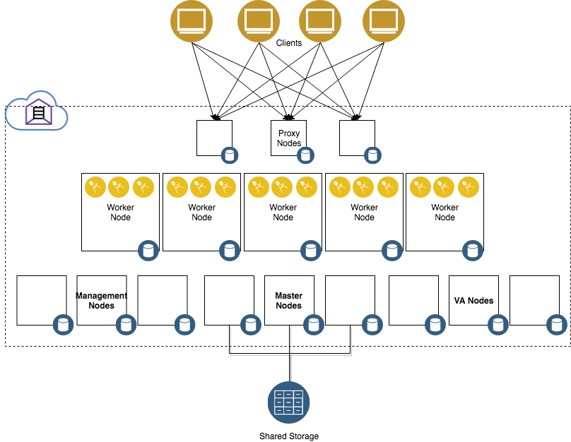

# Terraform ICP VMware HA

This Terraform example configurations uses the [VMware vSphere provider](https://www.terraform.io/docs/providers/vsphere/index.html) to provision virtual machines on VMware
and [TerraForm Module ICP Deploy](https://github.com/ibm-cloud-architecture/terraform-module-icp-deploy) to prepare VMs and deploy [IBM Cloud Private](https://www.ibm.com/cloud-computing/products/ibm-cloud-private/) on them.  This Terraform template automates best practices learned from installing ICP on VMware at numerous client sites in production.

This template provisions an HA cluster with ICP 2.1.0.2 enterprise edition.




### Pre-requisites

* Working copy of [Terraform](https://www.terraform.io/intro/getting-started/install.html)
* The example assumes the VMs are provisioned from a template that has ssh keys loaded in `${HOME}/.ssh/authorized_keys`. After VM creation, terraform will SSH into the VM to prepare and start installation of ICP using the SSH key provided
   If your VM template uses a different user from root, update the [`ssh_user` section in variables.tf](variables.tf#L154)
* The template is tested on VM templates based on Ubuntu 16.04

### VM Template image preparation

1. Create a VM image (RHEL or Ubuntu 16.04).
   * the automation will create an additional block device at unit number 1 (i.e. `/dev/sdb`) for local docker container images  and attempt to configure Docker in [direct-lvm](https://docs.docker.com/storage/storagedriver/device-mapper-driver/#configure-loop-lvm-mode-for-testing) mode.  Additional block devices are also mounted at various directories that hold ICP data depending on the node role.  You may pre-install docker, but it must be configured in direct-lvm mode, with the direct-lvm block device as the second disk.  The simplest way of getting this to work is to create a template with a single OS disk without installing docker and let the automation configure direct-lvm mode.

1. Append the public key to `$HOME/.ssh/authorized_keys` that corresponds to the `ssh_user` and `ssh_key_file` you will pass to terraform.

1. Ensure that the `ssh_user` can call `sudo` without password.

1. Install any other needed packages:
   1. Shared storage clients, e.g. if the shared storage is NFS for the registry and audit directories, install NFS clients.
   1. In environments with restricted outbound internet, the terraform automation requires and attempts to install `PyYAML`.  You can pre-install it into the template:
      - `yum install PyYAML` on RHEL
      - `apt install python-yaml` on Ubuntu
   1. Install VMware Tools or `open-vm-tools`
   1. For docker installation, install any additional pre-requisites:
      - `yum install device-mapper libseccomp libtool-ltdl libcgroup iptables` on RHEL
      - `apt install libtdl7 thin-provisioning-tools lvm2` on Ubuntu
   1. For RHEL templates, VMware guest customization requires `perl`.
   1. For RHEL templates, either disable the firewall (`systemctl disable firewalld`), or add `firewall_enabled: true` to `icp-config.yaml`.

1. (optional) If you are not providing `image_location`, and have pre-installed docker, you can also pre-load the docker images from the ICP package you wish to install.

   ```bash
   tar xf ibm-cloud-private-x86_64-2.1.0.2.tar.gz -O | sudo docker load
   ```

1. Shutdown the VM Convert to a template, make note the name of the template.

### Other environment preparation

The automation requires an HTTP or NFS server to hold the ICP binaries and docker packages.  NFS storage is recommended as it can host these binaries and also the shared storage location for `registry_mount_src`, `audit_mount_src`, `docker_package_location` and `image_location`.

### Using the Terraform templates

1. git clone or download the templates

1. Create a `terraform.tfvars` file to reflect your environment.  Please see [variables.tf](variables.tf) and below tables for variable names and descriptions.  Here is an example `terraform.tfvars` file:

   ```
   vsphere_server = "10.25.0.20"
   vsphere_user = "jkwong"
   vsphere_password = "MyPassword!"
   vsphere_datacenter = "DC1"
   vsphere_cluster = "Cluster1"
   vsphere_resource_pool = "/jkwong/ICP"
   network_label = "LabPrivate"
   datastore = "LabDatastore"
   template = "RHEL7-4-docker"
   staticipblock = "10.30.0.0/24"
   staticipblock_offset = 2
   gateway = "10.0.0.1"
   netmask = "16"
   dns_servers = [ "10.0.0.11", "10.0.0.12" ]
   network_cidr = "172.16.0.0/20"
   service_network_cidr = "192.168.0.0/24"
   master = {
       nodes = "3"
       docker_disk_size = 250
   }
   proxy = {
       nodes = "3"
   }
   worker = {
       nodes = "12"
       vcpu = "4"
       memory = "16384"
   }
   management = {
       nodes = "3"
       log_disk_size = 100
   }
   va = {
       nodes = "3"
   }
   icppassword = "admin"
   ssh_user = "jkwong"
   icp_inception_image = "ibmcom/icp-inception:2.1.0.2-ee"
   docker_package_location = "nfs:10.0.0.5:/storage/icp/2.1.0.2/GA/icp-docker-17.09_x86_64.bin"

   cluster_vip = "10.31.0.1"
   cluster_vip_iface = "ens160"
   proxy_vip = "10.31.0.2"
   proxy_vip_iface = "ens160"

   registry_mount_src = "10.0.0.5:/storage/jkwong/var_lib_registry"
   audit_mount_src = "10.0.0.5:/storage/jkwong/var_lib_icp_audit"
   ```

1. Run `terraform init` to download depenencies (modules and plugins)

1. Run `terraform plan` to investigate deployment plan

1. Run `terraform apply` to start deployment

### Terraform configuration

#### vSphere variables

| name | required                        | value        |
|----------------|------------|--------------|
| `vsphere_server`   | yes          | IP or hostname of vSphere server |
| `vsphere_user`   | yes          | Username for vSphere server |
| `vsphere_password`     | yes          | Password for vSphere user     |
| `allow_unverified_ssl`   | no           | SSL certificate verification when connecting to vSphere, `true` by default. |
| `vsphere_datacenter` | yes         | Name of the vSphere datacenter to deploy VMs to |
| `vsphere_cluster` | yes         | Name of the vSphere cluster to deploy VMs to (must be under the vSphere datacenter) |
| `vsphere_resource_pool` | no         | Path of the Resource Pool to deploy VMs to (must be under the vSphere cluster), will be in the format like `/path/to/target`, by default will add VMs to root resource pool in the cluster |
| `network_label` | yes         | Network label to place all VMs on |
| `datastore` | yes         | Name of the datastore to place all disk images in. |
| `folder` | no         | Name of the VM folder to create where all created VMs are placed in, if not supplied, will place in root folder. |
| `template` | yes         | Name of the VM template to use to create all VM images |

#### Network variables

*Although the template defaults configure the cluster using DHCP addresses, it is strongly recommended to configure values for each of these variables so that the cluster is configured using static IP addresses.*

| name |  value                                  |
|------------|------------------|
| `staticipblock` |  Subnet to place all VMs in, in CIDR notation.  Ensure that the subnet has enough useable address for all created VMs.  For example, 192.168.0.0/24 will contain 256 addresses.  It is recommended to set this variable so that the cluster is configured with static IP addresses. The default is set to `0.0.0.0/0` to retrieve from DHCP (not recommended). |
| `staticipblock_offset`  | Specify the starting offset of the staticipblock to begin assigning IP addresses from.  e.g. with staticipblock 192.168.0.0/16, offset of 10 will cause IP address assignment to begin at 192.168.0.11. |
| `gateway` | Default gateway to configure for all VMs.  Leave blank to retrieve from DHCP. |
| `netmask` | Number of bits, in CIDR notation, of the subnet netmask  (e.g. 16).  Set to `0` to retrieve from DHCP. |
| `dns_servers` | List of DNS servers to configure in the VMs.  By default, uses Google public DNS (`8.8.8.8` and `8.8.4.4`).  Set to blank to retrieve from DHCP. |
| `network_cidr` | Container overlay network subnet; this subnet is internal to the cluster but should not overlap with other subnets in the environment.  Default is `192.168.0.0/16` |
| `service_network_cidr` | Service network subnet; this is internal to the cluster but should not overlap with other subnets in the environment.  Default is `10.10.10.0/24 |

#### ICP Installation variables

| name | default value                       | value        |
|----------------|------------|--------------|
| `ssh_user` | `root` | User that terraform will SSH as, must have passwordless sudo access. |
| `ssh_keyfile` | `~/.ssh/id_rsa` | Path to a private key file to use for SSH access |
| `docker_package_location` | &lt;none&gt; | location of ICP docker package,  e.g. `http://<myhost>/icp-docker-17.09_x86_64.bin` or `nfs:<myhost>:/path/to/icp-docker-17.09_x86_64.bin` |
| `image_location` | &lt;none&gt; | location of ICP binary package,  e.g. `http://<myhost>/ibm-cloud-private-x86_64-2.1.0.2.tar.gz` or `nfs:<myhost>:/path/to/ibm-cloud-private-x86_64-2.1.0.2.tar.gz` |
| `icp_inception_image` | `ibmcom/icp-inception:2.1.0.2-ee` | Name of the `icp-inception` image to use.  You may need to change it to install a different version of ICP. |

#### ICP Configuration Variables

The ICP configuration can further be customized by editing the [icp-config.yaml](icp-config.yaml) file and by following the [product documentation](https://www.ibm.com/support/knowledgecenter/SSBS6K_2.1.0.2/installing/config_yaml.html).  The Terraform templates here expose the key variables that have infrastructure dependencies.

| name | required                        | value        |
|----------------|------------|--------------|
| `proxy_vip` | no | Virtual IP address for the Proxy Nodes. One of `proxy_vip` or `proxy_lb_address` must be set for HA. |
| `proxy_vip_iface` | no | Network interface to use for the Proxy Node virtual IP.  Must be set if `proxy_vip` is set. |
| `cluster_vip` | no | Virtual IP address for the Master node console. One of `cluster_vip` or `cluster_lb_address` must be set for HA. |
| `cluster_vip_iface` | no | Network Interface to use for the Master node console.  Must be set if `cluster_vip` is set. |
| `proxy_lb_address` | no | External load balancer address for the Proxy Nodes.  One of `proxy_vip` or `proxy_lb_address` must be set for HA. |
| `cluster_lb_address` | no | External load balancer address for the Master node console. One of `cluster_vip` or `cluster_lb_address` must be set for HA. |
| `registry_mount_src` | yes | Source of the shared storage for the registry directory `/var/lib/registry` |
| `registry_mount_type` | no | Type of mountpoint for the registry shared storage directory.  `nfs` by default. |
| `registry_mount_options` | no | Mount options to pass to the registry mountpoint.  `defaults` by default. |
| `audit_mount_src` | yes | Source of the shared storage for the audit directory `/var/lib/icp/audit` |
| `audit_mount_type` | no | Type of mountpoint for the audit shared storage directory.  `nfs` by default. |
| `audit_mount_options` | no | Mount options to pass to the audit mountpoint.  `defaults` by default. |
